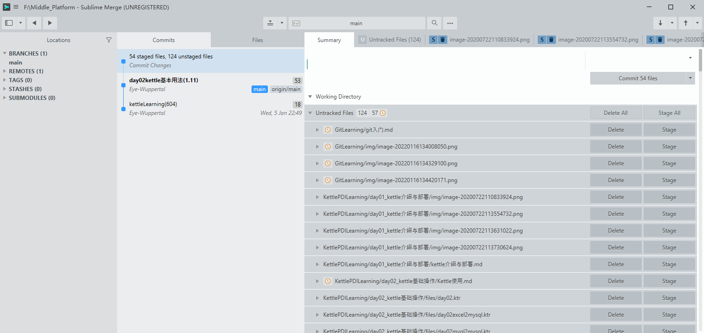

Git_Learning 

Git是目前世界上最先进的分布式版本控制系统。


# 1. 版本控制的主要用途

1. 管理不同的版本， 且可以随时回退到任意时刻
2. 协同开发，合并代码

# 2. 基础配置

```shell
git config --global user.name "******"
git config --global user.email "*****@**"
```

# 3. 基础操作

```shell
# 初始化一个仓库
git init 
# 查看仓库信息
git status
# 将单个文件添加到暂存区
git add <filename>
git add . # 将仓库目录下所有文件添加到暂存区
# 撤销暂存区的文件
git reset <filename>
# 提交变更（只会提交暂存区的文件）
git commit -m <message>
# 版本回退 (git reflog可以看到回退记录)
git reset <commitID> 
# 查看日志(可以查看所有的提交信息)
git log
```

# 4. 文件的四种状态

untracked、unmodified、modified、staged


# 5. 分支Branch

初始化仓库时会生成一个master分支，一般作为主分支

```shell
# 创建新的分支 name: 分支名 template: 以哪个分支或commit为模板，默认为当前分支
# 新分支会继承模板分支的提交记录
git checkout -b <name> <template>
git branch # 查看所有分支
git checkout <name> # 切换分支
```

# 6. 合并Merge

```shell
git merge <branchName> # 在当前分支合并branchName分支变更
## example H有一个版本，交给A、B分别负责一部分工作
# 1. 切换到原分支
git checkout "H"
# 2. 新建分支
git checkout -b "H-A"
git checkout -b "H-B"
# 3. 做出更改后提交
git checkout "H-A"
git commit -m "A has changed"
git checkout "H-B"
git commit -m "B has changed"
# 4. 合并分支
git checkout "H"
git merge "H-A"
git merge "H-B"
# 5. 出现冲突，解决冲突
git add .
git commit -m "解决冲突"
```

# 7. 远程仓库remote

```shell
git clone *******  # 远程克隆一个仓库
git fetch # 拉取远程仓库信息
git push  # 将本地的commit上传到远程仓库
# 如果是本地新切的分支，提交时需要设置上流分支
git push --setup-stream origin <branchName>
# 如果想使用他人建立的分支，需要先将远程仓库的分支拉取到本地
git pull # 相当于先fetch再自动merge
```


可视化git提交管理 sublime-merge




