# Applying Apache Spark on Streaming Big Data for Health Status Prediction

## 1. 背景

1.1 医疗保健系统中的⼤数据由⼤量数据组成，可⽤于深⼊了解医疗保健数据并⽀持医疗保健决策。

1.2 物联网时代，智能穿戴设备普及，实时记录用户的身体状态信息，为医疗解决方案提供不同数据源提供的数据。

1.3 多类神经⽹络和多类随机森林算法代表了⼀种⽤于移动计算应⽤的⾼效推理机。

1.4 流式健康数据为⽀持医疗保健领域的决策⽀持系统提供了⼀种有效的解决⽅案.

## 2. 相关工作

2.1 由智能穿戴设备的多传感器监控不同的健康参数。

2.2 基于 Microsoft Azure 云系统的医疗保健系统。

2.3 智能穿戴设备采集的数据发送至云中的用户个人资料。

2.4 机器学习模型在云中运行，以告知医疗保健提供者有关乳腺癌的预测。

## 3. 方法

在这项研究中，可穿戴医疗传感器⽤于持续监测⾝体测量值，包括⼼率、糖尿病⽔平、⾎压、体温、⾝体活动和⾎氧⽔平。

提出的云端疾病监测系统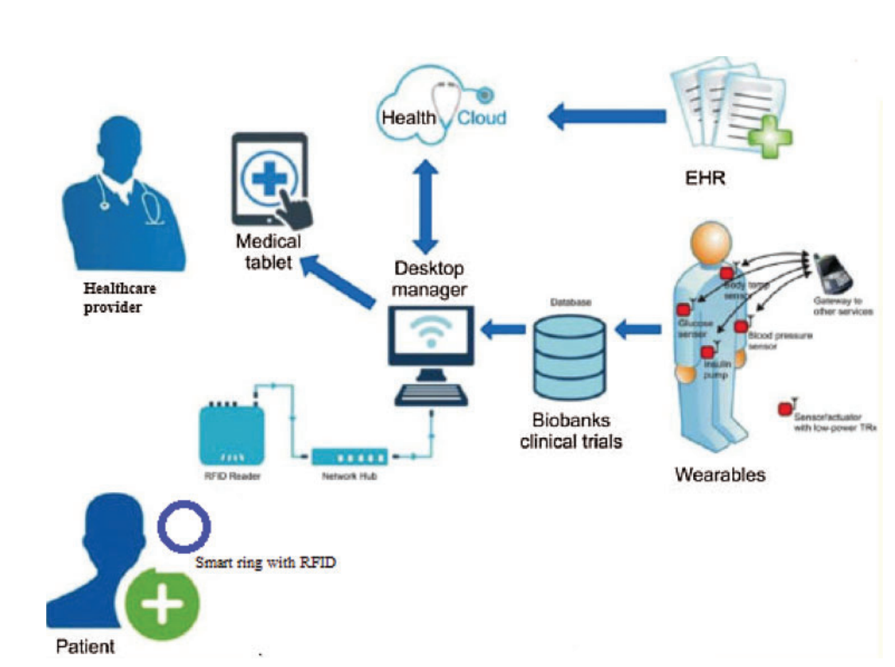

biobanks clinical trials（生物样本库临床试验）

### 3.1 EHR

患者可以访问 EHR，并将其作为有价值的医疗记录共享，EHR 包含临床医⽣或医疗保健提供建议或开出所需药物所需的所有数据 

医疗⼤数据包括图像（如 X 射线、MRI 和照⽚）、⾳频⽂件、医疗报告以及脑电图和⼼电图等波分析。Apache Spark 从不同来源收集医疗 EHR 数据，例如可穿戴设备和存储在 Hadoop 分布式⽂件系统中的⽤⼾医疗数据配置⽂件。收集到的异构数据可以通过 Spark 过滤器转换进⾏过滤，以去除噪声数据。

### 3.2 建议系统

建议系统根据医疗数据、家庭医疗数据、来⾃可穿戴设备的流数据以及⽤⼾的个⼈资料数据（例如位置和常⻅疾病）收集和建模 EHR。数据根据⽤⼾当前的疾病、家庭慢性病和医疗保健提供者的建议进⾏分类。该系统根据有关数据洞察的⾼⻛险率进⾏预测。

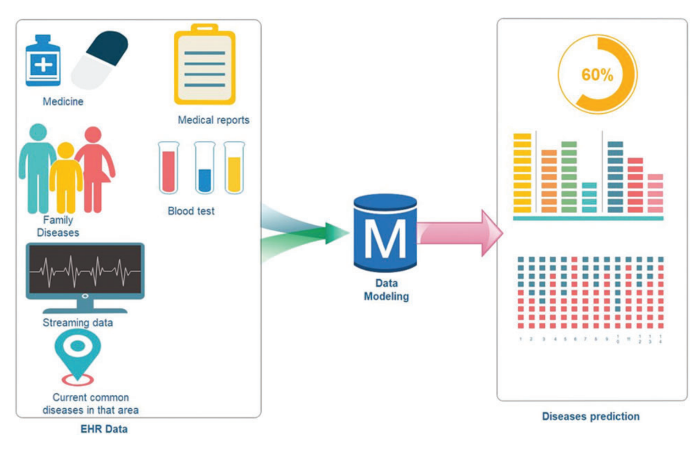

wearable ring将用户身体信息通过手机Internet传输到云中的用户个人资料，数据在预测系统进行预测后将预测结果返回至数据仓库，联系来自EHR的医疗数据，在云中得到结果通过Microsoft Power BI可视化呈现，给出建议或警告。

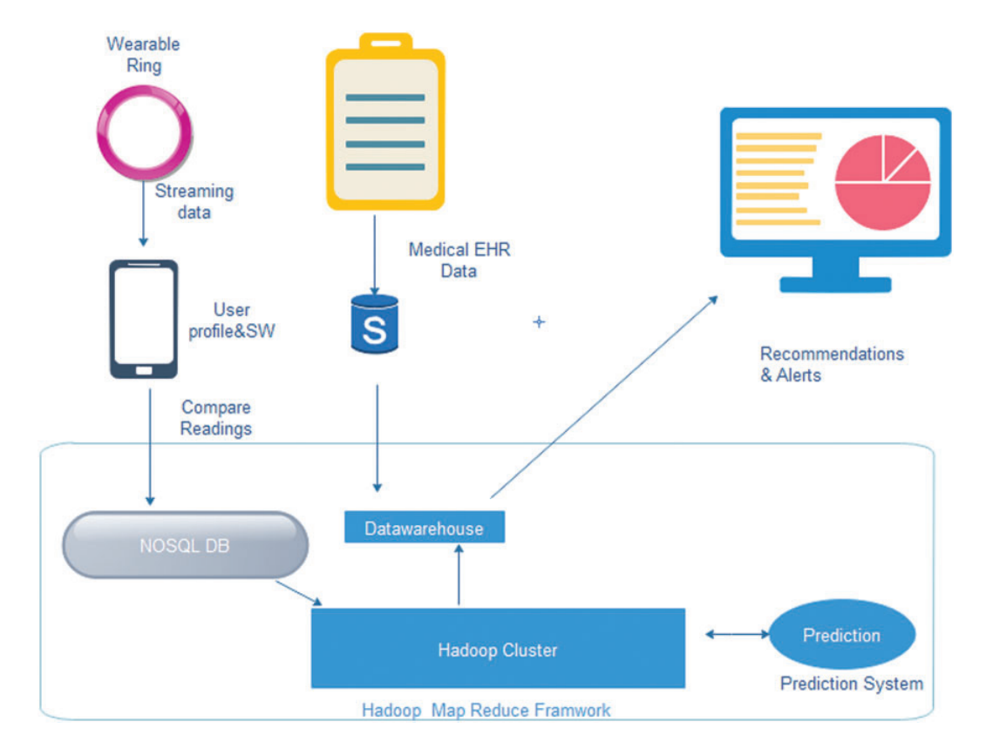

### 3.3 疾病预测方法

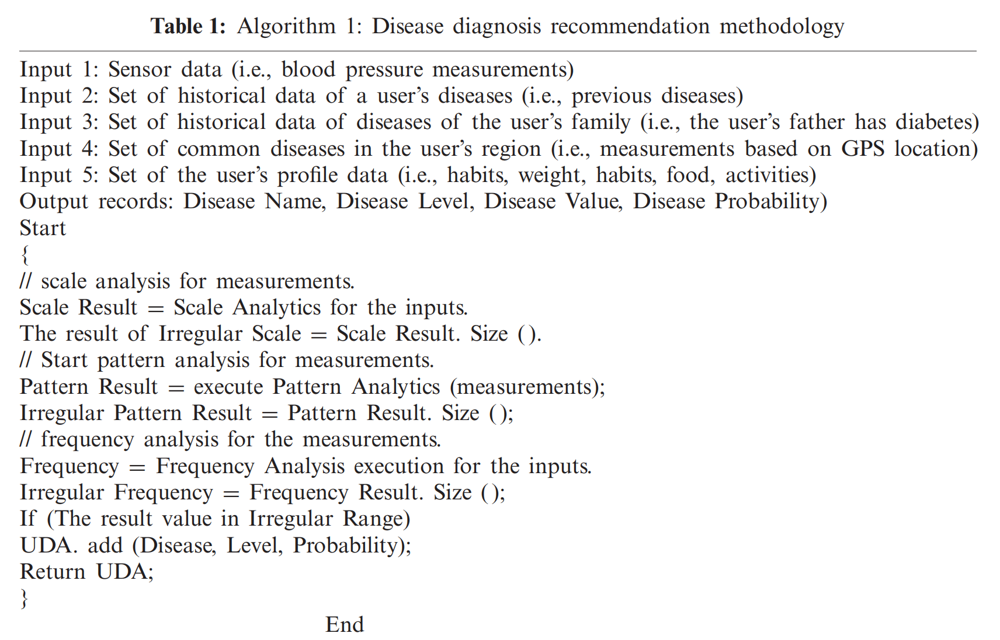

针对疾病发生的可能性设定阈值

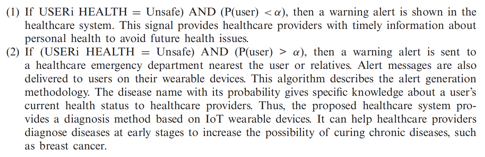

⽤⼾的健康状况通过互联⽹通过智能⼿机发送，流式API通过推送技术不断发送健康状态数据，并提供订阅机制，以便⽤⼾可以选择实时接收警报。

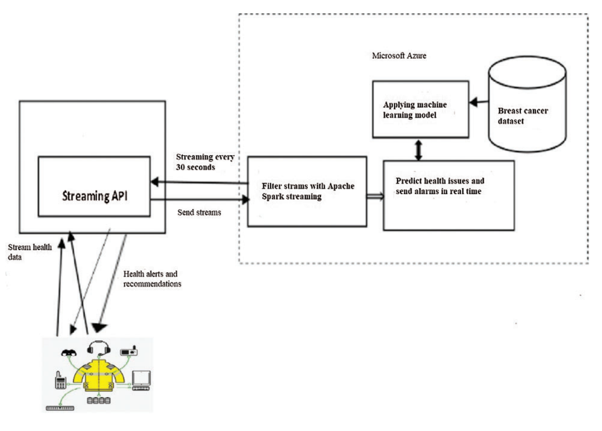

### 3.4 按需技术

所提出的系统提出了⼀种按需技术来接收来⾃医疗保健可穿戴设备的数据，并且仅根据患者医疗状况的阈值按需将数据发送到服务器。因此，该系统提供了⼀种有效的解决⽅案，仅当传感器检测到异常读数时才保存所需的记录。

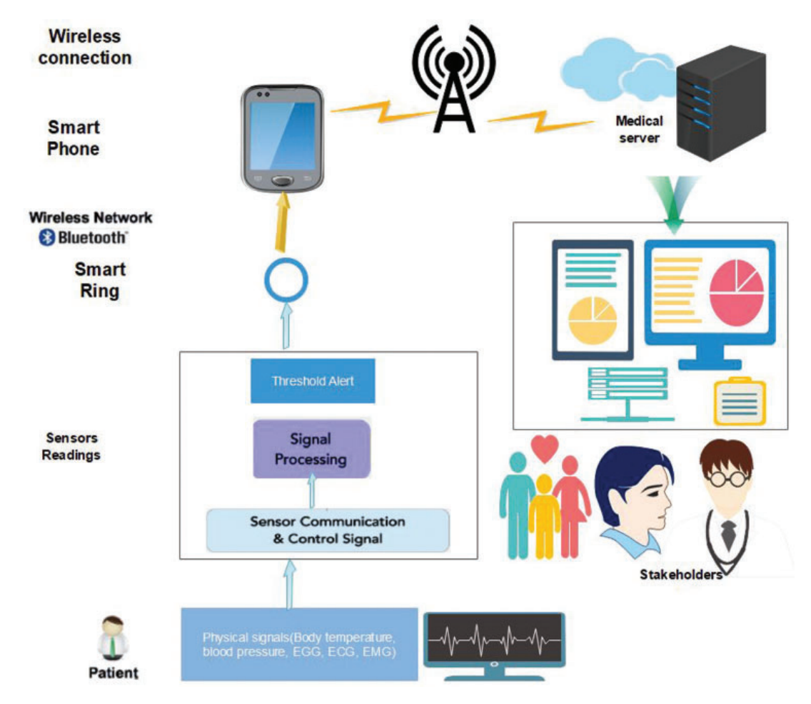

建议系统根据输入数据做出预测和决策，如下为spark数据交互结构，Apache 提供的 ML lib 包含各种算法，如聚类、分类和协同过滤，⽤于过滤数据中的属性 

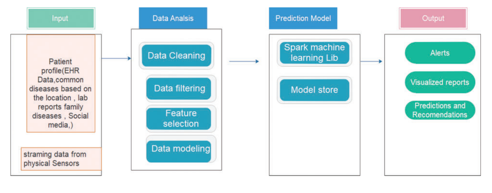

提出的系统有五层，在第⼀层，传感器检测到的医疗数据被收集为事件源，并通过智能⼿机发送到第⼆层。⽤⼾可以通过智能⼿机、平板电脑、笔记本电脑和电脑访问私⼈医疗数据。在第⼆层，数据按需传输到不同的路径。第⼀条路径连接到第三层的流数据，第三层仅发送有关智能⼿机医疗传感器测量结果的 JSON 数据。第⼆条路径连接到收集所有其他医疗数据的慢速轨道，例如医疗图像（例如 X 射线和 CRT）、医疗报告、处⽅、实验室测试、历史医疗数据、家庭历史数据和环境参数（例如，位置）和常⻅疾病，来⾃医疗保健提供者。在快⻋道第三层，实时提供建议和警报。在慢速第三层中，数据被批处理到 Cosmos DB 中进⾏分析并显⽰在最后⼀层。在最后⼀层或决策层，医疗保健提供者被赋予有关⽤⼾健康状况的指标

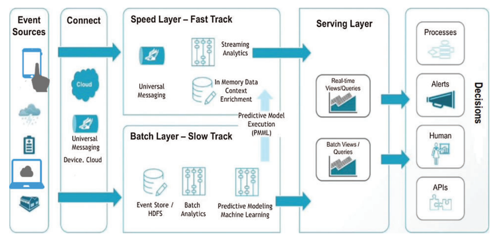

 在 Microsoft Azure 上提出的机器学习算法

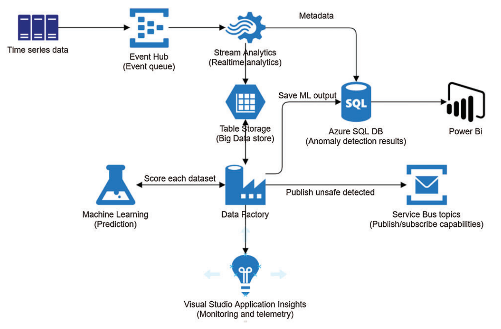

## 4. 测试

系统使⽤ Apache Spark 进⾏医疗流数据分析。它可以使⽤ Spark SQL 和 DataFrames 以及实时流处理实时查询处理。在 Microsoft Azure 机器学习⼯作室的云平台上进⾏培训，分别使用多类神经⽹络和多类随机森林来确定最适合预测过程的算法。

训练模型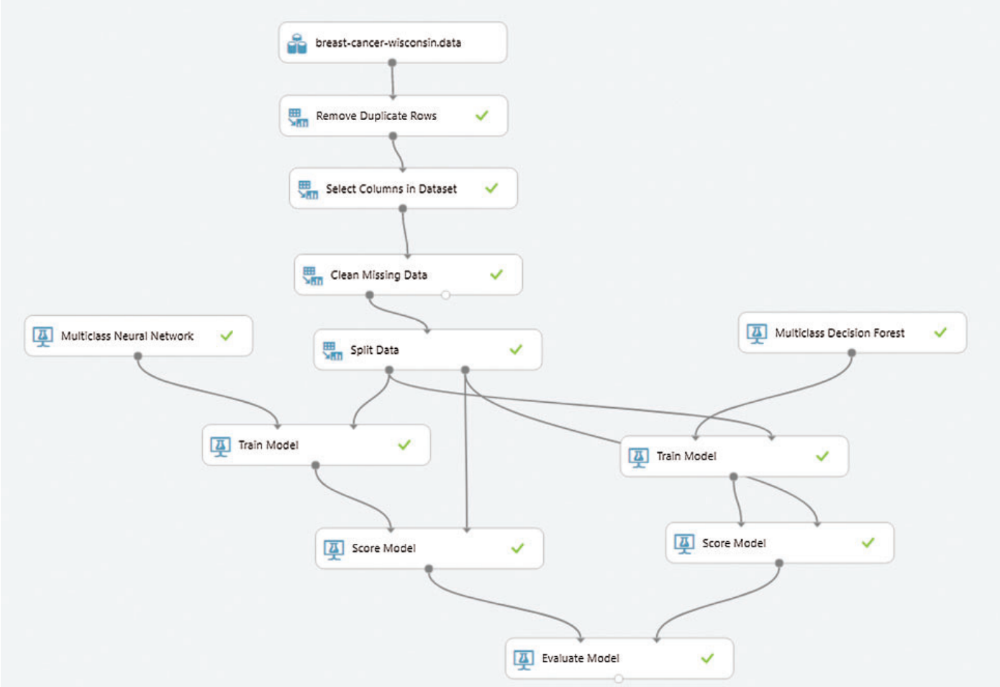

## 5. 结论

该研究提出了⼀种基于 Apache Spark 的系统来处理云中的流数据。通过该系统，Spark 的分析特征可以通过机器学习算法⽤于预测乳腺癌。在预测乳腺癌⽅⾯，多类神经⽹络的应⽤⽐多类随机森林更有效。决策级别融合算法⽤于为每个传感器定义适当的阈值，以便在读数显⽰异常级别时发送数据。该预测系统帮助⽤⼾根据给定的数据识别潜在⻛险；即系统可以根据历史数据、家庭数据和基于EHR和流数据的⽤⼾档案，以概率呈现潜在疾病。尽管该系统在没有医⽣协助的情况下⽆法提供解决⽅案，但它会推荐特定的医⽣，并推荐最佳的咨询时间。这项研究开发了先进的机器学习模型来分析从可穿戴设备收集的时间序列健康数据，并预测⼏种⽣命体征和健康疾病。

UCI，“威斯康星州乳腺癌（原始）数据集”，2021 年。[在线]。可⽤的：http://archive.ics.uci.edu/ml/datasets/breast+cancer+wisconsin+%28original%29.