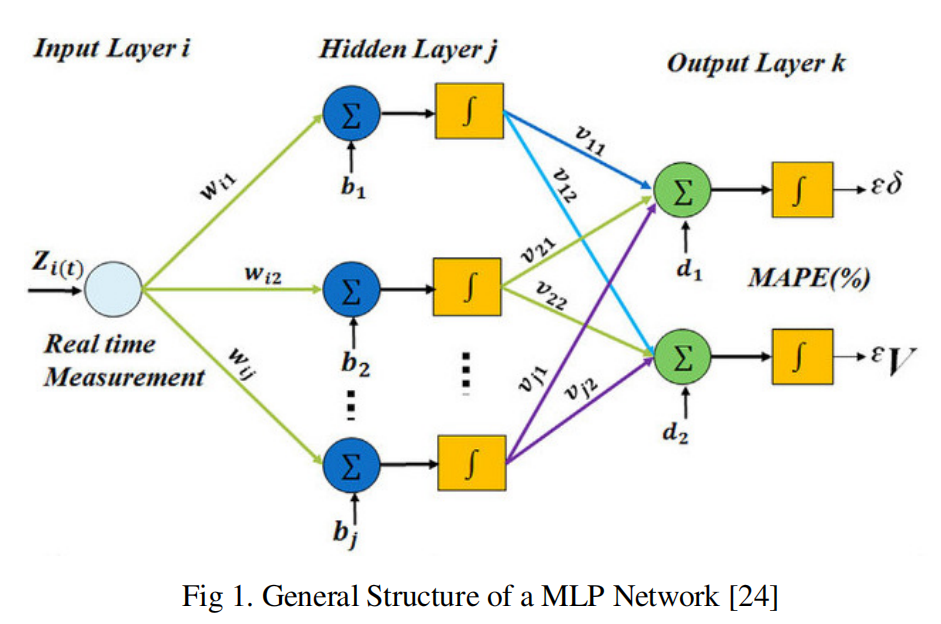
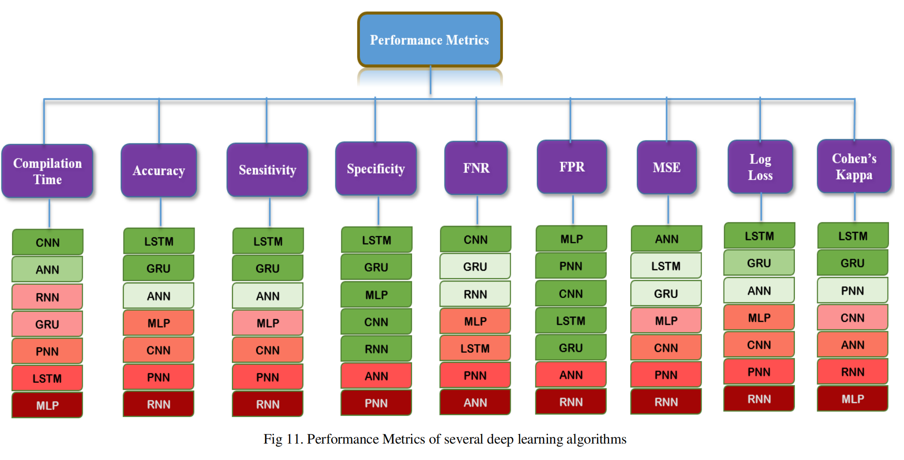
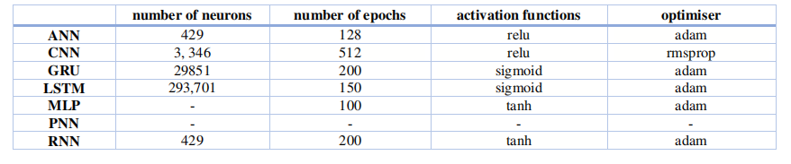
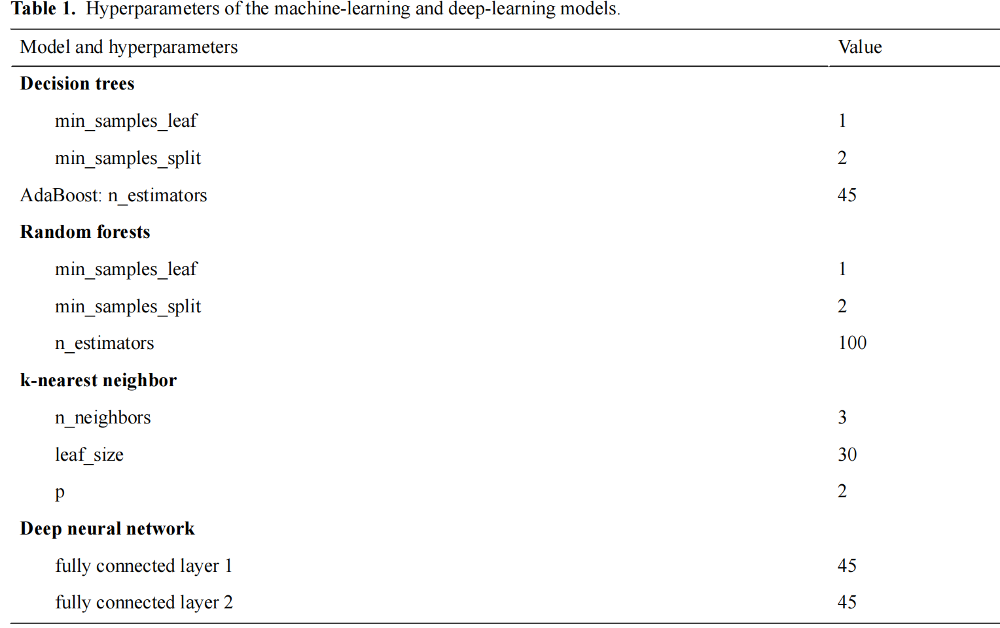
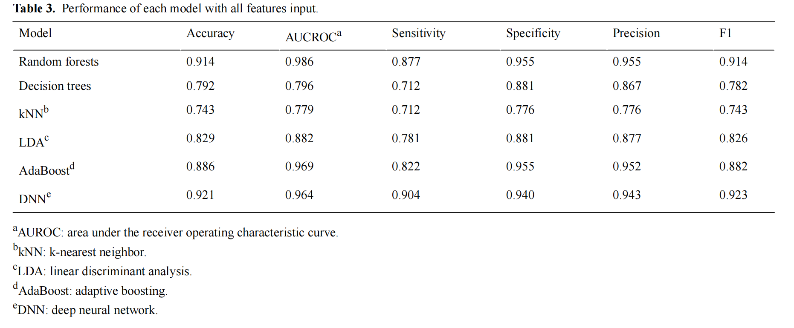
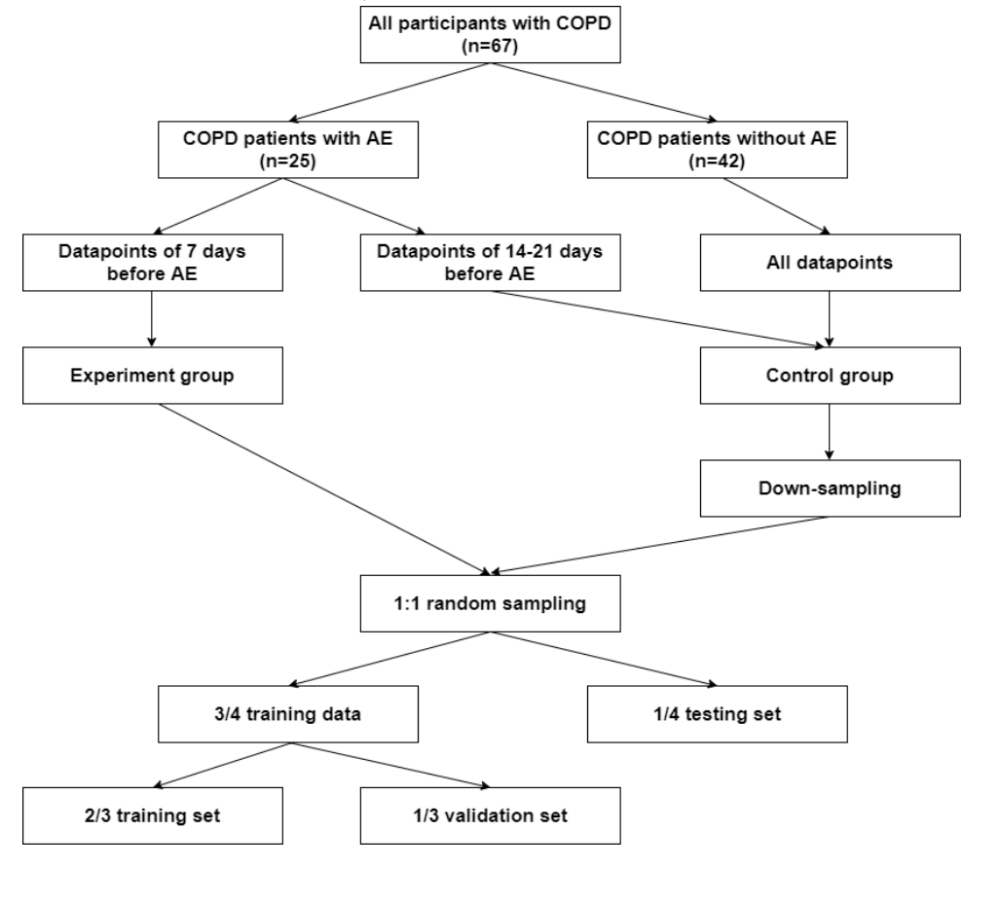
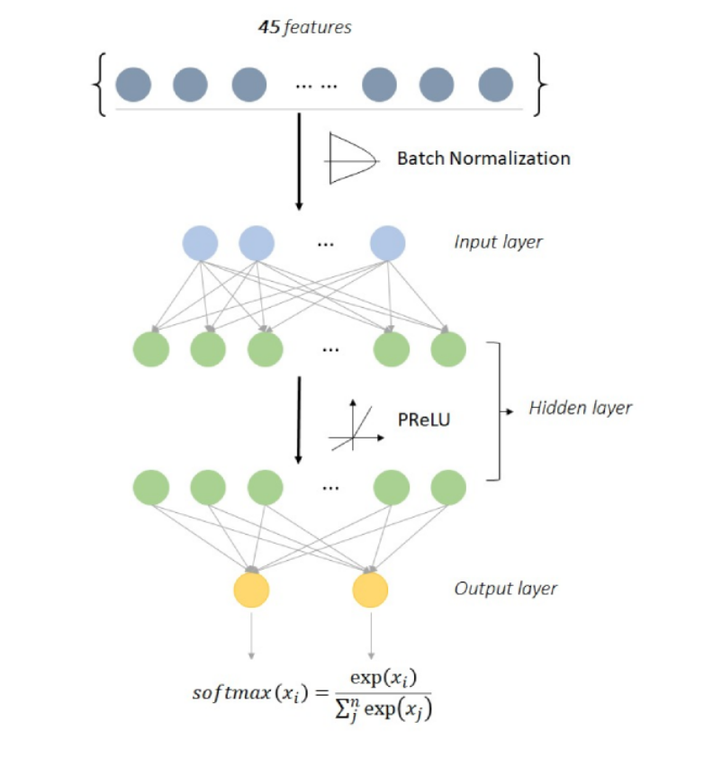
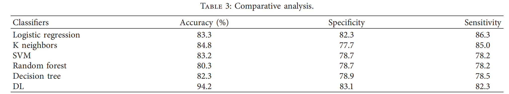

A Performance Based Study on Deep Learning Algorithms in the Effective Prediction of Breast Cancer

CNN  卷积神经网络

ANN 人工神经网络

RNN 循环神经网络

GRU 循环神经网络（RNN的一种）

PNN 概率神经网络

LSTM 长短期记忆体

MLP 多层感知器

GRU和LSTM比较适合

Acute Exacerbation of a Chronic Obstructive Pulmonary Disease Prediction System Using Wearable Device Data, Machine Learning, and Deep Learning: Development and Cohort Study

决策规则

DNN模型

DNN

Prediction of Heart Disease Using a Combination of Machine Learning and Deep Learning

