# 1. 中台的战略背景 

## 1.1前、后台

前台就是用户直接接触到的产品部分，如可在应用商店下载的APP，像微信、抖音、淘宝，或者可以使用的网站等

后台是由各个业务管理系统组成的后端平台，包含两个部分：

1. 企业的内部管理服务的统称，如：内部的CRM，ERP等；
2. 为前台提供服务能力的，如：数据压缩能力，并发等。

两者的关系：

在应用中后台提供能力与计算，前台将后台的能力进行封装以图形化的形式展示给用户，让用户能更容易的使用公司提供的服务来解决个人需求。

## 1.2 烟囱式架构弊端

“烟囱式”系统：一种不能与其他系统进行有效协调工作的信息系统，又称为孤岛系统。

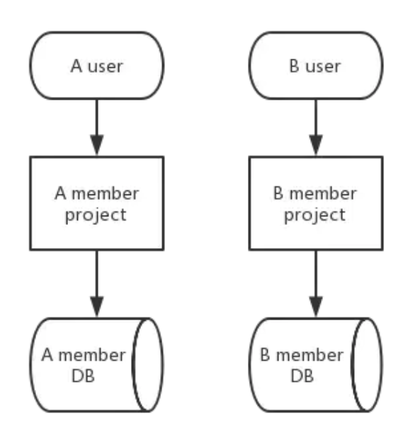

1. 重复开发建设，重复维护带来的重复投资

2. 技术栈不一样，系统间交互集成的打通成本高

3. 不利于业务的沉淀和持续发展

   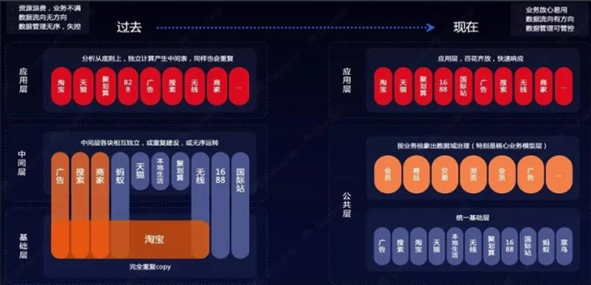

## 1.3 国内大数据发展势态

2014年开始，行业陆续启动企业数字化转型战略

企业数字化转型战略目标是

1. 保持竞争优势
2. 构建市场生态
3. 探索模式创新
4. 提升生产效率
5. 优化资源配置

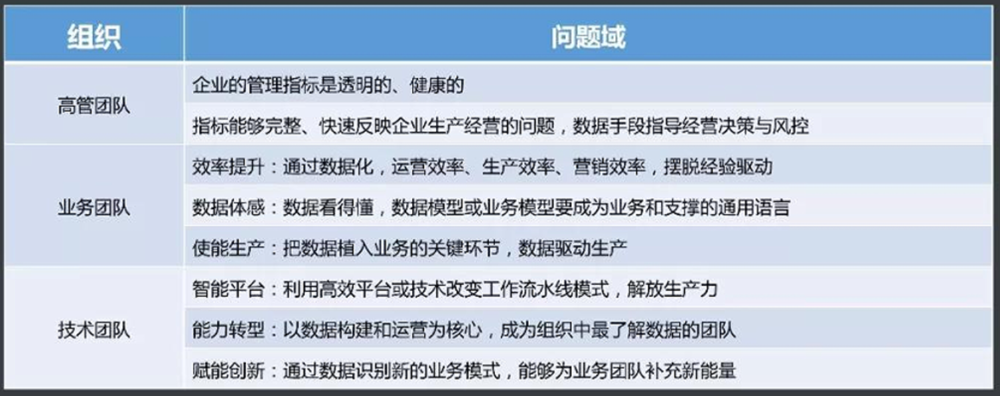

## 1.4架构改造目标

框架路线必须满足至少10年的集团业务发展要求

## 1.5中台基础-共享服务体系

我们需要一个能最少改动就能完成大部分需求的解决方案，这就是中台——为不同的前台业务提供可以重复使用的能力，形成一次建设多次使用。

面向服务架构SOA（Service Oriented Architecture）服务重用  （ESB）

# 2.数据中台

1 、数据中台是聚合和治理跨域数据，将数据抽象封装成服务，提供给前台以业务价值的逻辑概念。

2 、数据中台是一套可持续 “ 让企业的数据用起来 ” 的机制，一种战略选择和组织形式，是依据企业特有的业务模式和组织架构，通过有形的产品和实施方法论支撑，构建一套持续不断把数据变成资产并服务于业务的机制。

3 、数据中台连接数据前台和后台，突破数据局限，为企业提供更灵活、高效、低成本的数据分析挖掘服务，避免企业为满足具体某部门某种数据分析需求而投放大量高成本、重复性的数据开发成本。

4 、数据中台是指通过数据技术，对海量数据进行采集、计算、存储、加工，同时统一标准和口径。数据中台把数据统一之后，会形成标准数据，再进行存储，形成大数据资产层，进而为客户提供高效服务。

5 、数据中台，包括平台、工具、数据、组织、流程、规范等一切与企业数据资产如何用起来所相关的。

中台概念的鼻祖——阿里巴巴的数据产品部总经理朋新宇表示：

数据中台是数据+技术+产品+组织的组合，是企业开展新型运营的一个中枢系统。具象的说，它是一套解决方案，抽象的理解，它是一种新的公司运营理念。

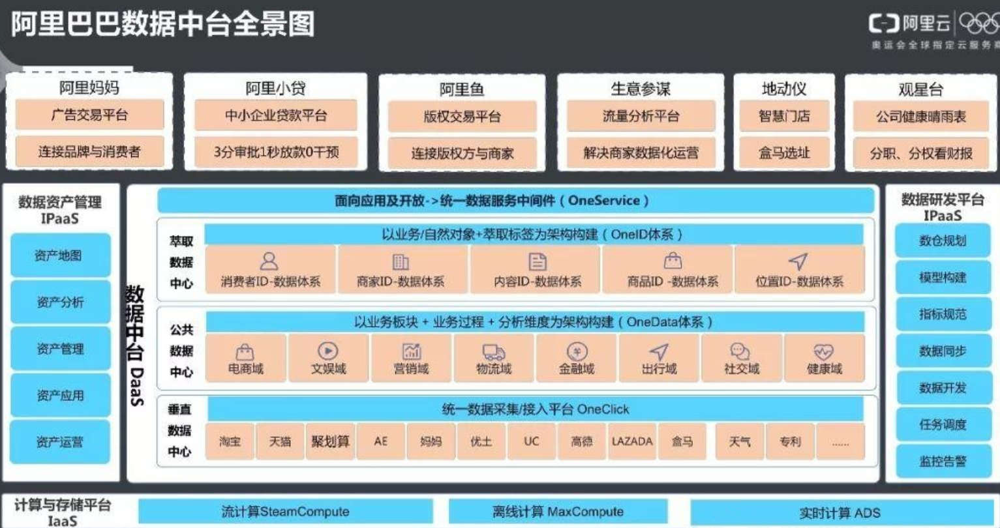

# 3.业务中台

企业所有能力建设都是服务于前台一线业务的。从这个角度来讲，所有中台应该都可以称为业务中台。

但我们所说的业务中台一般是指支持企业线上核心业务的中台。

业务中台承载了企业核心关键业务，是企业的核心业务能力，也是企业数字化转型的重点。业务中台的建设目标是：“将可复用的业务能力沉淀到业务中台，实现企业级业务能力复用和各业务板块之间的联通和协同，确保关键业务链路的稳定高效，提升业务创新效能。”

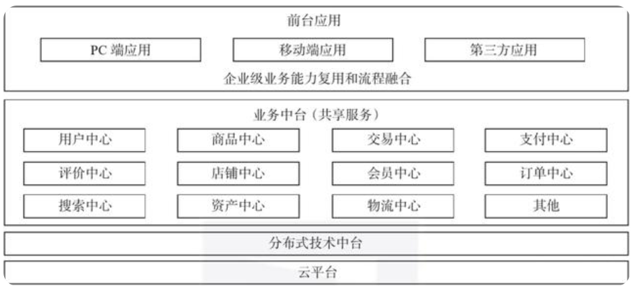

# 4.数据中台+业务中台

## 4.1两中台间的协作融合

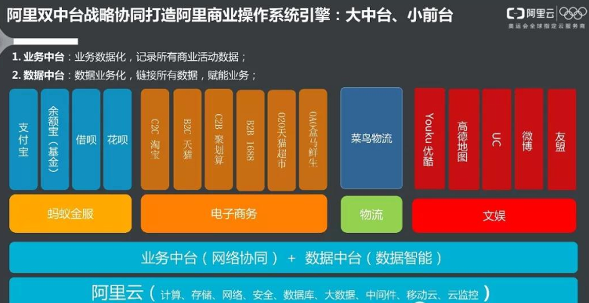

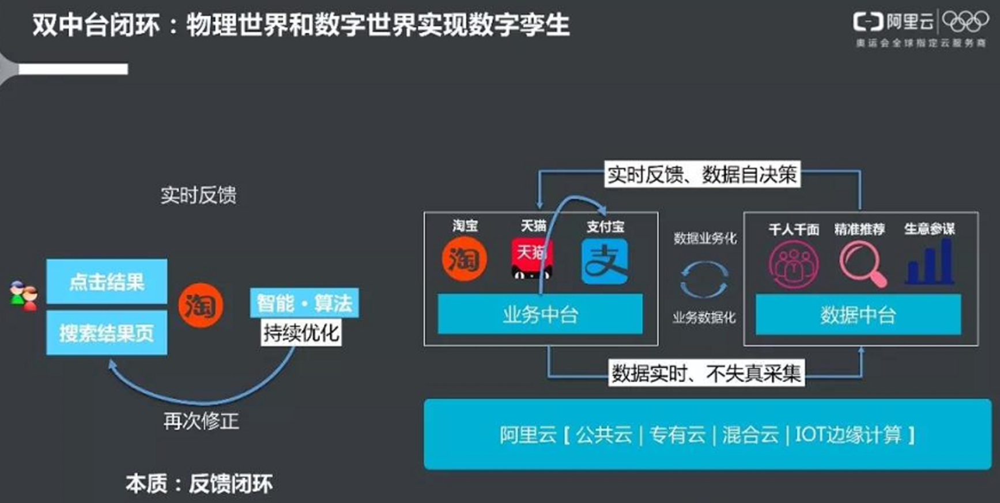

业务数据化：就是所有的商业活动都应该记录下相关的数据，这是业务中台应该承担的使命。

数据业务化：本质就是从数据中发现价值，反过来赋能业务。

未来万物互联的世界将你所有的行为实时记录下来，形成另一个数字化的你，这就是数字孪生，如果业务中台是你，那数据中台就是你的兄弟。

## 4.2数据赋能业务的四大典型场景

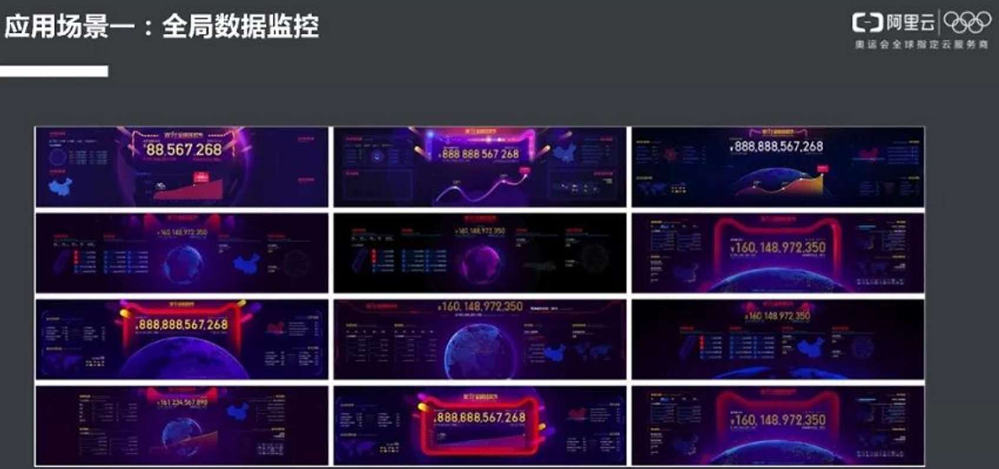

全局数据监控：本质就是指标+报表+可视化，这是给管理者看的，当然业务人员也要看

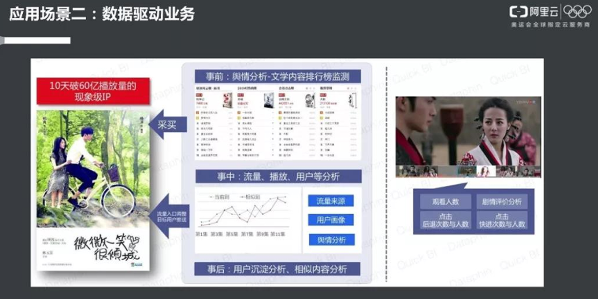

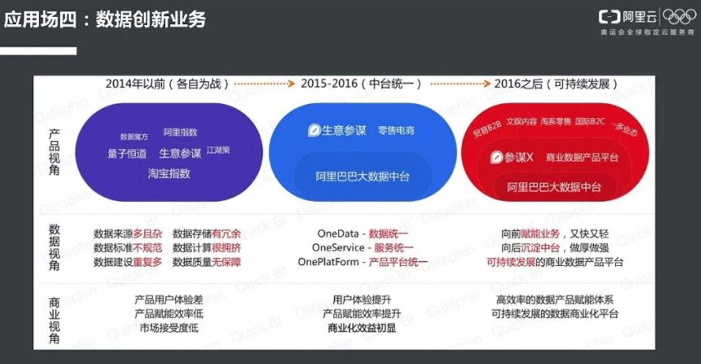

## 4.3中台建设前后效果对比

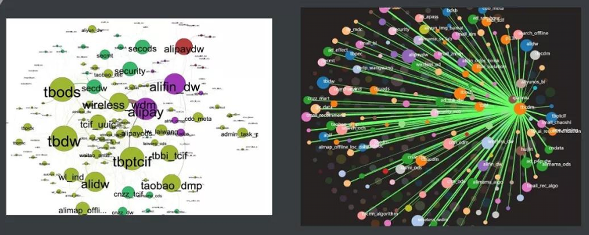